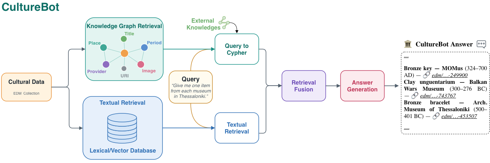

# CultureBot

<div align="center">

**Explore cultural heritage collections with grounded, source-linked answers.**

<a href="">
  
</a>
<a href="#paper">
  
</a>
<a href="#quick-start">
  
</a>

</div>


CultureBot is a reusable, open-source pipeline for turning **your own cultural-heritage data** into a conversational research and discovery experience.

Bring collection records, catalogue descriptions, reports, or an optional knowledge graph. CultureBot combines **FAISS semantic search**, **BM25 keyword search**, and—when available—**Neo4j graph retrieval** to answer questions in Greek or English. Answers are grounded in retrieved records and include their source URIs.

The included examples use the visual language of Ancient Greek monuments and museums, but the pipeline is collection-independent: adapt it to an archive, museum, library, archaeological project, or digital-humanities corpus.

> [!NOTE]
> This repository contains the runnable demo system. The CultureBot demo paper is currently in preparation; publication and citation details will be added here when available.

## Table of contents

- [Why CultureBot?](#why-culturebot)
- [Try the demo](#try-the-demo)
- [How it works](#how-it-works)
- [Bring your own collection](#bring-your-own-collection)
- [Quick start](#quick-start)
- [Configure CultureBot](#configure-culturebot)
- [Use a Neo4j knowledge graph](#use-a-neo4j-knowledge-graph)
- [Everyday commands](#everyday-commands)
- [Repository structure](#repository-structure)
- [Troubleshooting](#troubleshooting)
- [Security, privacy, and cost](#security-privacy-and-cost)
- [Paper](#paper)

## Why CultureBot?

Cultural collections are rich in names, places, periods, materials, relationships, and uncertain interpretations. A useful assistant must do more than retrieve text that looks similar to a question.

CultureBot is designed around three principles:

| Principle | What it means in the demo |
|---|---|
| **Bring your own data** | Point the pipeline at Markdown, PDF, JSONL, or JSON files. Filenames do not matter, and subfolders are scanned automatically. |
| **Combine text and structure** | Use hybrid FAISS + BM25 retrieval on its own, or merge it with validated, read-only Cypher queries over a Neo4j knowledge graph. |
| **Keep answers traceable** | Retrieved records remain the evidence: answers cite the source URI of the cultural objects they use. |

You can run CultureBot in three modes:

| Mode | Retrieval path | Neo4j required? | Good starting point for |
|---|---|---:|---|
| `rag` | FAISS semantic search + BM25, fused with Reciprocal Rank Fusion | No | Documents, catalogue text, reports, and a first local demo |
| `kg` | Natural language → validated Cypher → graph records | Yes | Collections whose structured relationships are central |
| `hybrid` | Knowledge graph + hybrid text retrieval in one grounded answer | Yes, with automatic RAG fallback | The full CultureBot |

## Try the demo

- **Project page:** [geofila.github.io/CultureBot](https://geofila.github.io/CultureBot/)


Example questions for a Greek cultural collection:

```text
(EN) Which marble sculptures in the collection belong to the Roman period?

(EN) Show me objects connected to Athens and explain how their dates differ.

(GR) Ποια αντικείμενα βρέθηκαν στην Πάτρα και χρονολογούνται στη Ρωμαϊκή περίοδο;
```

## How it works



The browser interface is provided by [Open WebUI](https://github.com/open-webui/open-webui). It talks to an [Open WebUI Pipelines](https://github.com/open-webui/pipelines) service that loads your collection, builds the search indexes, optionally queries Neo4j, and asks the configured language model to compose the final answer.

## Bring your own collection

Put your files anywhere under `dataset/`. CultureBot walks subfolders and classifies files by extension and content shape.

| Input | How CultureBot uses it |
|---|---|
| `.md`, `.markdown` | Splits the text by headings and indexes the resulting chunks for hybrid search |
| `.pdf` | Extracts and indexes text page by page; scanned PDFs need OCR first |
| `.jsonl`, `.ndjson` | Reads one `{id, text}` record per line; also provides record text for graph results |
| `.json` | Detects record collections, place taxonomies, or filter vocabularies from the JSON shape |

Files containing `.example.` in their name, `README.md`, dotfiles, and files inside a `cache/` folder are skipped intentionally.

### Recommended Markdown format

Markdown is the easiest route to a first demo. Use one heading per cultural object and include a stable `URI:` so CultureBot can cite it.

```markdown
## Marble portrait head
- URI: https://example.org/collection/object/0001

**Type:** Sculpture
**Material:** Marble
**Time period:** 101–200 CE
**Location found:** Athens

**Description:**
A catalogue description of the object, its condition, interpretation,
provenance, and any other text that should be searchable.
```

### Recommended JSONL format

For large collections, use one object per line:

```json
{"id":"https://example.org/collection/object/0001","text":"**Title:** Marble portrait head\n**Description:** ..."}
```

When using Neo4j, the `id` must match the identifier stored on the corresponding `ProvidedCHO` node. That is how graph results are joined back to the textual evidence used in an answer.

### PDFs

Drop text-based PDFs directly into `dataset/`; every page becomes a searchable chunk. A scanned document without a text layer will not be indexed, so apply OCR before adding it.

For every accepted field alias and JSON shape, see [`dataset/README.md`](dataset/README.md).

## Quick start

### Requirements

- Linux, macOS, or Windows
- [Docker](https://docs.docker.com/get-docker/) with Docker Compose v2
- Around 15 GB of free disk space for the first image build
- An [OpenAI API key](https://platform.openai.com/api-keys) with available credit
- Your collection files
- Optional: a Neo4j database for `kg` or `hybrid` mode

No GPU is required with the default configuration. The first build usually takes 20–40 minutes because Docker downloads the pipeline dependencies.

### 1. Clone the deployment branch

```bash
git clone --branch culture_deploy --single-branch https://github.com/geofila/CultureBot.git
cd CultureBot
```

### 2. Create your environment file

```bash
cp .env.example .env
openssl rand -hex 32
openssl rand -hex 32
```

Open `.env` and set these three required values:

```ini
OPENAI_API_KEY=sk-proj-REPLACE-WITH-YOUR-KEY
WEBUI_SECRET_KEY=REPLACE-WITH-THE-FIRST-RANDOM-STRING
PIPELINES_API_KEY=REPLACE-WITH-THE-SECOND-RANDOM-STRING
```

- `WEBUI_SECRET_KEY` signs browser sessions.
- `PIPELINES_API_KEY` authenticates Open WebUI to the pipeline service. Keep it nearby; you will enter it once in the web interface.
- `.env` is ignored by Git. Still, check `git status` before every push and never commit a real key.

> [!IMPORTANT]
> In the main `KGSearchCultureBot` pipeline, the generation model is controlled by the `OPENAI_MODEL` **valve in the web admin panel**, not by the `.env` value. If your API project cannot access the default model, change that valve after startup.

### 3. Add your data

Copy collection files into `dataset/`; names and subfolders are up to you.

```bash
cp ~/my-collection/catalogue.md dataset/
cp ~/my-collection/research-report.pdf dataset/
cp ~/my-collection/records.jsonl dataset/
```

The repository includes `.example.*` files that document the accepted formats. They are not indexed as collection data.

### 4. Optional: connect Neo4j

If you want graph or hybrid retrieval, add the connection to `.env`:

```ini
NEO4J_URI=neo4j://your-neo4j-host:7687
NEO4J_USER=neo4j
NEO4J_PASSWORD=REPLACE-WITH-YOUR-PASSWORD
```

If Neo4j runs on your computer, do not use `localhost`: from inside the pipeline container, that points back to the container. With Docker Desktop, use `host.docker.internal`; otherwise use a hostname or reachable machine IP.

If you do not have a graph, skip this step and select `rag` mode after startup.

### 5. Start CultureBot

```bash
docker compose up -d
docker compose logs -f pipelines
```

Press `Ctrl+C` to stop following the log; the containers keep running. Check their state with:

```bash
docker compose ps
```

Verify that CultureBot discovered the expected files:

```bash
docker compose logs pipelines | grep -A20 "Dataset scan"
```

Every source is reported as loaded, skipped, empty, unsupported, or unreadable. Resolve unexpected entries before continuing.

### 6. Create the administrator account

1. Open [http://localhost:12012](http://localhost:12012).
2. Select **Sign up** and create the first account.

The first account becomes the administrator. Later accounts remain pending until the administrator approves them.

### 7. Connect Open WebUI to CultureBot

In Open WebUI:

1. Open **Admin Panel → Settings → Connections**.
2. Under **OpenAI API**, add a connection.
3. Set **URL / Base URL** to `http://pipelines:9099`.
4. Set **API Key** to the `PIPELINES_API_KEY` value from `.env`.
5. Save.

Use `http://pipelines:9099` exactly. It is the service address inside the Docker network; `localhost:12011` will not work from the Open WebUI container.

Start a new chat. The model selector should now include:

- **KGSearchCultureBot V2 (Clean)** — the main graph + hybrid RAG pipeline
- **CultureBot** — the simpler RAG-only pipeline

### 8. Choose a mode and ask a question

Select **KGSearchCultureBot V2 (Clean)**. If you did not configure Neo4j, open **Admin Panel → Pipelines**, select the CultureBot pipeline, and set `QUERY_MODE` to `rag`.

Ask a question covered by your collection. The first request initializes the indexes and may take a few minutes; later requests reuse the disk cache.

```text
Show me marble sculptures from the Roman period and cite the relevant records.
```

If the answer is grounded in your data and contains source URIs, your collection demo is ready.

## Configure CultureBot

Open **Admin Panel → Pipelines**, select `KGSearchCultureBot`, adjust the valves, and save.

| Valve | Default | Purpose |
|---|---|---|
| `OPENAI_MODEL` | `gpt-5.5` | Generation model used by the main pipeline; change this if your API project cannot access the default |
| `QUERY_MODE` | `hybrid` | `rag`, `kg`, or `hybrid` |
| `EMBEDDING_MODEL` | `text-embedding-3-small` | OpenAI embeddings by default; local alternatives include `sentence-transformers/all-MiniLM-L6-v2` and `Qwen/Qwen3-Embedding-0.6B` |
| `TOP_K_SEMANTIC` | `100` | Number of FAISS candidates retrieved |
| `TOP_K_BM25` | `100` | Number of BM25 candidates retrieved |
| `TEMPERATURE` | `0.2` | Lower values favor more literal, stable answers |
| `RAG_SOURCES` | `auto` | `auto`, `text`, `records`, or `all` |
| `DATASET_DIR` | `/app/pipelines/dataset` | Dataset path inside the container |
| `EXTRA_FILES` | empty | Comma-separated paths to additional mounted files |

`RAG_SOURCES=auto` indexes Markdown and PDF content when present. If the collection only contains JSON/JSONL records, it indexes those instead. This avoids embedding two representations of the same collection by default.

Changing the embedding model or retrieval settings invalidates the cached index. The next question rebuilds it.

You may override the mode for a conversation by adding one of these tags to its system prompt:

```text
[mode:rag]
[mode:kg]
[mode:hybrid]
```

## Use a Neo4j knowledge graph

CultureBot's NL-to-Cypher prompt targets a specific cultural-heritage schema. Before connecting a different graph, review the complete schema and examples at the top of [`sources/pipelines/sc_kg_nl2cypher.py`](sources/pipelines/sc_kg_nl2cypher.py).

The expected graph includes entities such as:

- `Entity:ProvidedCHO`
- `Entity:Place`
- `Entity:TimeSpan`
- `Entity:Concept`
- `Material`

and relationships including `LOCATED_IN`, `HAS_TEMPORAL_REFERENCE`, `FROM_PERIOD`, `HAS_TYPE`, `HAS_SUBJECT`, and `MADE_OF`.

Generated Cypher is validated as read-only before execution. For defense in depth, connect CultureBot with a Neo4j user that has read-only permissions.

## Everyday commands

| Task | Command |
|---|---|
| Start | `docker compose up -d` |
| Stop | `docker compose down` |
| View pipeline logs | `docker compose logs -f pipelines` |
| Check service status | `docker compose ps` |
| Restart after changing data | `docker compose restart pipelines` |
| Apply `.env` changes | `docker compose up -d --force-recreate` |
| Rebuild after changing pipeline code | `./rebuild.sh` |
| Full no-cache rebuild | `./rebuild.sh --full` |
| Full rebuild and delete accounts/runtime data | `./rebuild.sh --full --wipe` |

The index fingerprint includes the selected embedding settings and source files. Adding, editing, or removing collection data triggers a rebuild after the pipeline restarts.

## Repository structure

```text
.
├── compose.yml
├── .env.example
├── dataset/                          # Put your collection here
│   ├── README.md                     # Detailed input-format reference
│   ├── *.example.*                   # Format examples, not indexed
│   └── kg_jsons/                     # Example taxonomy/filter JSON
├── data/                             # Runtime data and index cache, ignored by Git
├── docs/assets/culturebot-hero.png   # README hero artwork
├── rebuild.sh
└── sources/
    ├── Dockerfile.pipelines
    └── pipelines/
        ├── KGSearchCultureBot_v2.py  # Main KG + hybrid RAG pipeline
        ├── SearchCultureBot.py       # Simpler RAG-only pipeline
        ├── dataset_loader.py         # Filename-independent data discovery
        └── sc_kg_nl2cypher.py        # NL-to-Cypher prompt, schema, validation
```

## Troubleshooting

<details>
<summary><strong>Compose says that a required key is missing</strong></summary>

Create `.env` from `.env.example` and fill `OPENAI_API_KEY`, `WEBUI_SECRET_KEY`, and `PIPELINES_API_KEY`. Run all Docker commands from the repository root.

</details>

<details>
<summary><strong>No models appear in Open WebUI</strong></summary>

Repeat the connection step. The base URL must be `http://pipelines:9099`, and the API key must match `PIPELINES_API_KEY` exactly.

</details>

<details>
<summary><strong>A collection file was ignored</strong></summary>

Inspect the dataset scan:

```bash
docker compose logs pipelines | grep -A20 "Dataset scan"
docker compose exec pipelines ls -R /app/pipelines/dataset
```

- `unsupported`: convert the file to Markdown, PDF, JSONL, or JSON.
- `empty`: the file has no content.
- `unreadable`: fix malformed JSON or apply OCR to a scanned PDF.
- not listed: check whether its name contains `.example.`, it is a `README.md` or dotfile, or it lives inside `cache/`.

</details>

<details>
<summary><strong>The OpenAI API returns a model error</strong></summary>

Your API project may not have access to the default generation model. Change the main pipeline's `OPENAI_MODEL` valve in **Admin Panel → Pipelines** to a model available to your project. Editing `OPENAI_MODEL` in `.env` only changes the simpler pipeline.

</details>

<details>
<summary><strong>Graph retrieval returns no records</strong></summary>

Check the Neo4j connection, use a host reachable from the container, and confirm that graph identifiers match the JSONL `id` values or Markdown `URI:` values exactly. Also confirm that your graph follows the schema documented in `sc_kg_nl2cypher.py`.

</details>

<details>
<summary><strong>I need to force a complete re-index</strong></summary>

The cache normally invalidates automatically. To remove it manually:

```bash
docker compose down
rm -rf data/pipelines-cache
docker compose up -d
```

</details>

<details>
<summary><strong>Docker reports that a port is already allocated</strong></summary>

Change the host side—the left number—of the relevant port mapping in `compose.yml`, for example `127.0.0.1:13012:8080`.

</details>

## Security, privacy, and cost

- `.env`, runtime data, and non-example collection files are ignored by Git. Always verify with `git status` before pushing.
- The dataset is mounted read-only into the pipeline container; it is not baked into the Docker image.
- Both exposed ports are bound to `127.0.0.1` by default. Use a TLS reverse proxy before publishing the service.
- Keep `DEFAULT_USER_ROLE=pending` if the deployment is reachable by others.
- Use a read-only Neo4j account even though generated Cypher is validated before execution.
- With the default OpenAI embedding and generation settings, collection text is sent to the configured OpenAI-compatible API. A local embedding model keeps index construction local, but answer generation still uses the configured model endpoint.
- The first query embeds the collection and costs more than later cached queries. Start with `text-embedding-3-small`, or use `sentence-transformers/all-MiniLM-L6-v2` for local CPU embeddings.

## Paper

CultureBot accompanies the demo paper:

> **CultureBot: Exploring Cultural Heritage Collections with Large Language Models**
>
> Demo paper in preparation.

The work presents a repository-independent framework for natural-language exploration of cultural heritage collections through graph-guided and textual retrieval with source-linked generation. The current demonstration is instantiated on [SearchCulture](https://searchculture.gr/) data for movable monuments from the Hellenic Ministry of Culture, while this repository packages the pipeline so it can be reused with other collections.

Citation metadata, authors, venue, DOI, and a canonical BibTeX entry will be added when the paper is available. Until then, please link to this repository and the [project page](https://geofila.github.io/CultureBot/).

---

<div align="center">

[Project page](https://geofila.github.io/CultureBot/) · [Input formats](dataset/README.md)

</div>
